# Graphical User Interface

**Manager Login** : Entry point of the application, every time the manager starts LaTazza, he has to log in using the credentials provided by the software vendor otherwise he is not able to perform any operation.

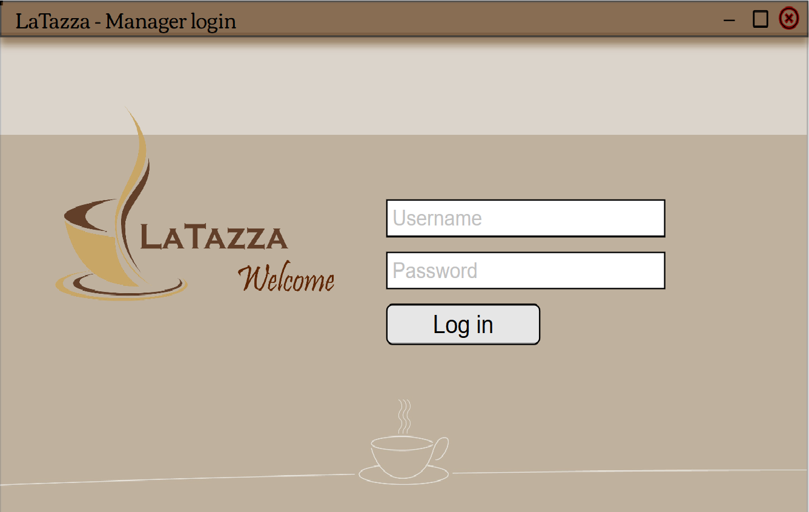

*Figure 1 : LaTazza login*

**Homepage** : Main window of the application. Starting from this point the manager can perform all the operations.

* Sell : Allows to sell capsules to either an employee or a visitor
* Buy : Allows to make an order to a coffee supplier
* Manage : Allows to manage the employee accounts and supplier information
* Summary : A brief summary about how many capsules remain and the account balance

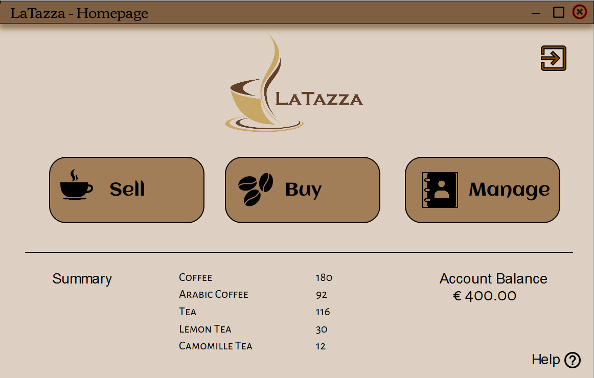

*Figure 2: LaTazza Homepage*

## Sell 

### The manager can sell capsules to either an employee or a visitor choosing the right tab.

* **Visitor** : The manager inserts the quantity for each capsule type according to visitor request, who will pay by cash.
 
  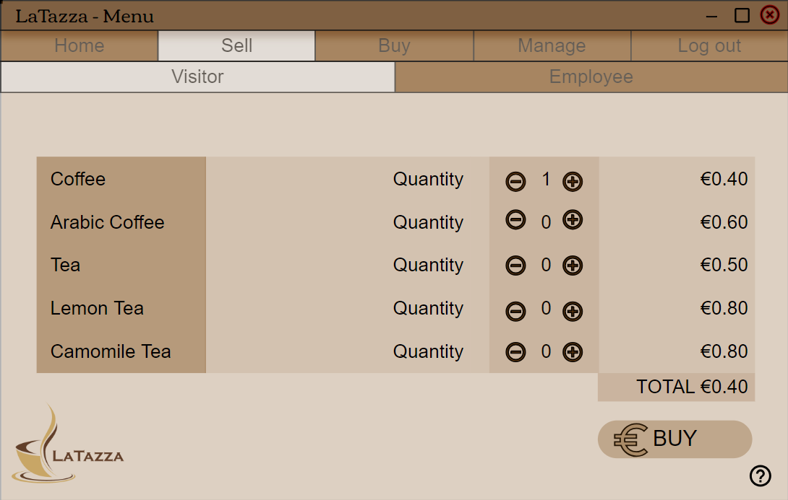
  
  *Figure 3 : Sell capsules to a visitor*

*  **Employee** : The manager can either sell capsules to an employee or add credits to the employee account.

1. **Capsule**  : Through this interface the manager can handle capsules sale to an employee who can pay by cash or by account credit.

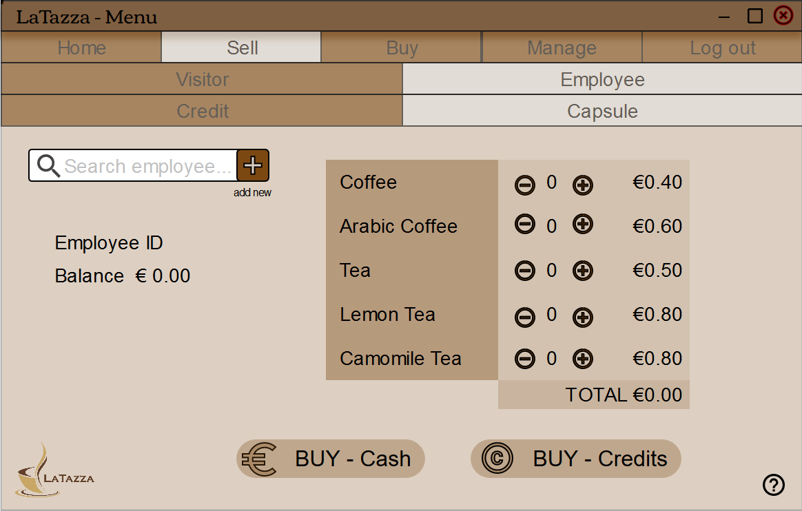

*Figure 4 : Sell capsules to an employee*
  
2. **Credits** : The manager can add credits to an employee account.

  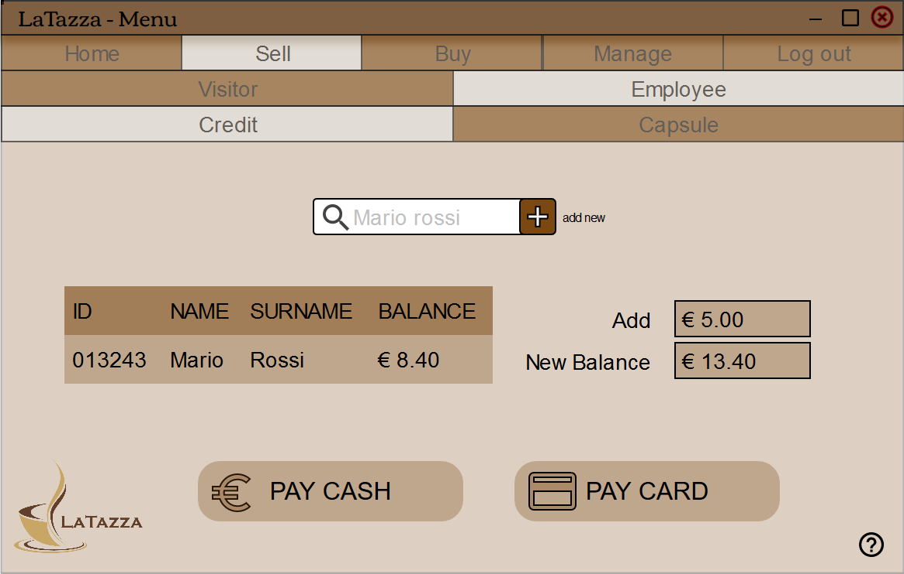
  
  *Figure 5 : Add credits*
  
  
## Buy

### The manager can send an order to the supplier in order to buy capsules box.

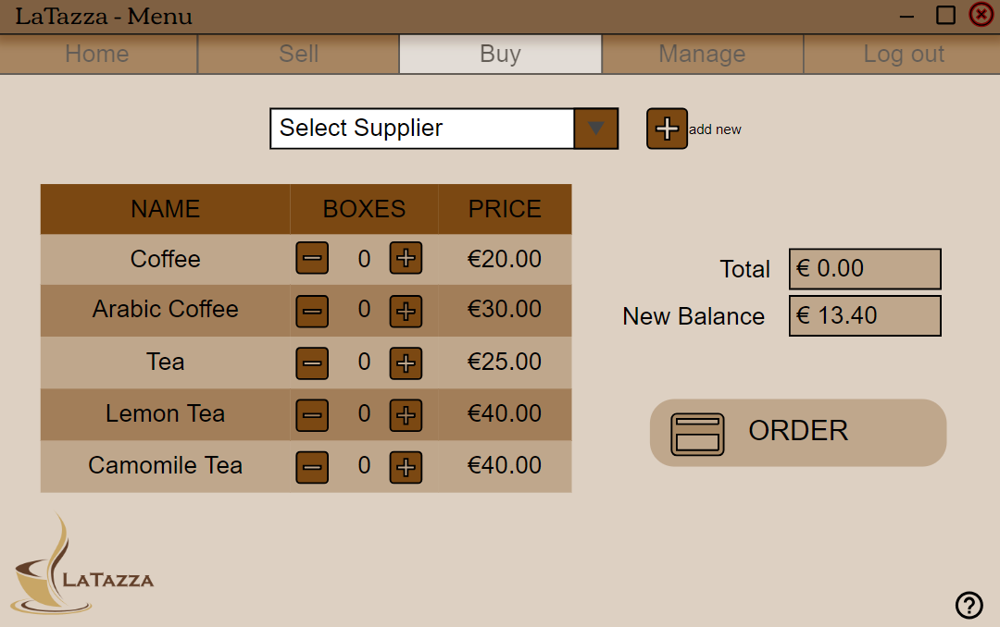

*Figure 6 : Send order*

## Manage

### Through this section the manager can handle the information about employees' account and supplier.

#### Employee

- **Insert** : The manager can add a new employee

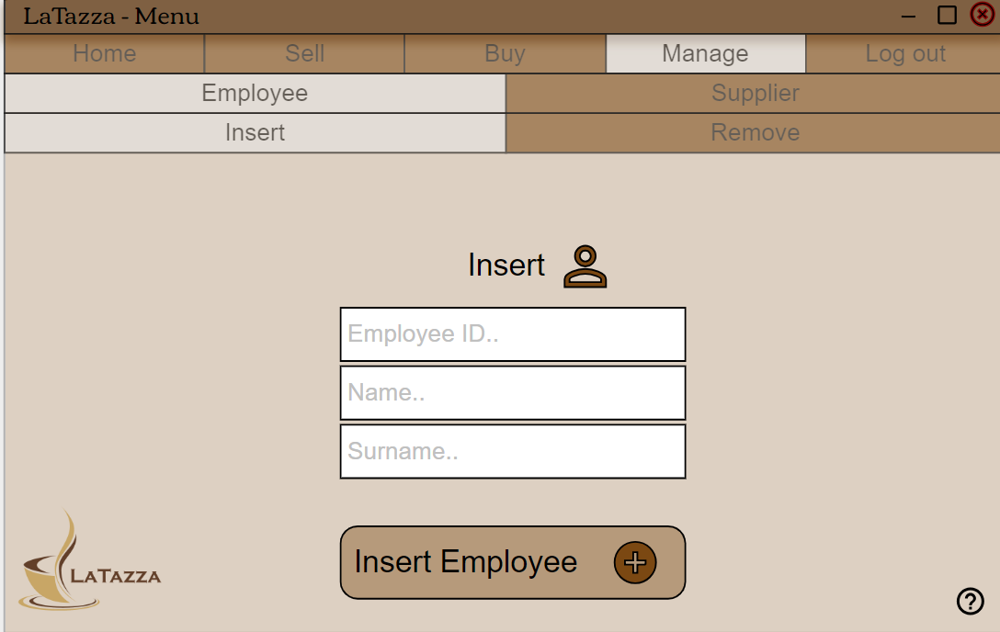

*Figure 7 : Add a new employee*
 
- **Remove** : The manager can remove an employee unless he or she has a debt.

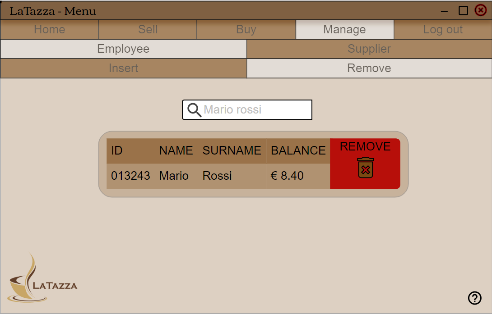

*Figure 8 : Remove an employee account*

#### Supplier 

- **Insert** : The manager can add a new supplier.

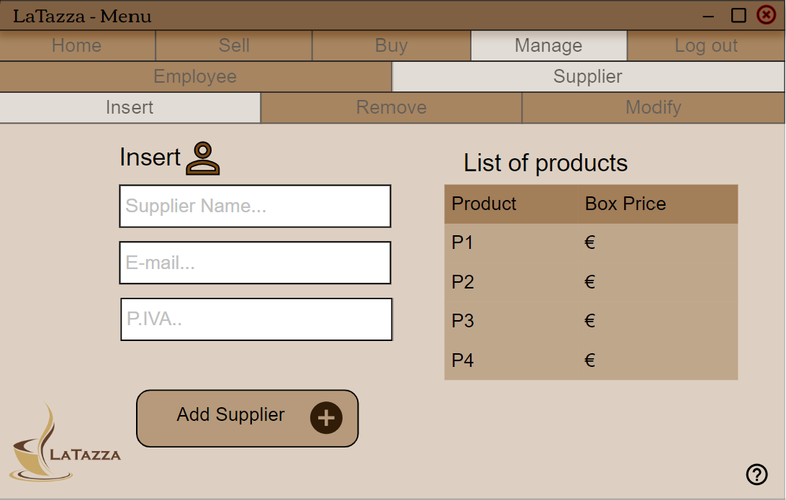

*Figure 9 : Add a new supplier*

- **Remove** : The manager can remove a supplier

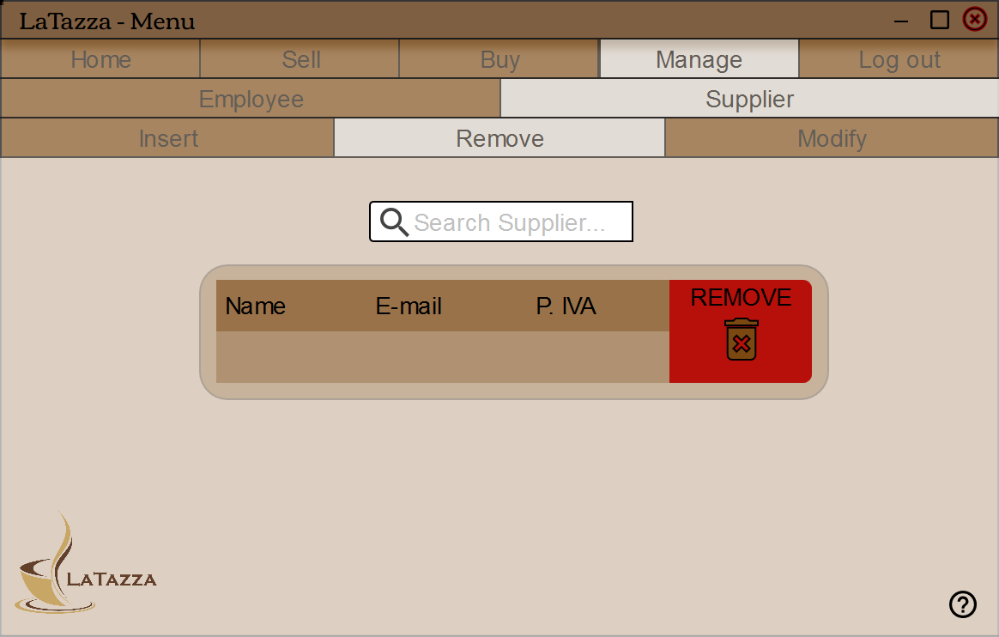

*Figure 10 : Remove a supplier*

- **Modify** : The manager can modify information about a supplier

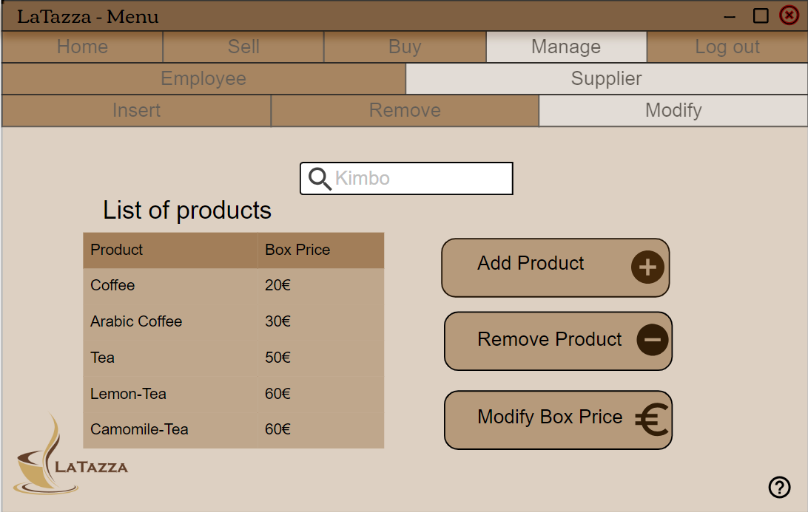

*Figure 11 : Modify supplier*

## Help
### The manager can solve his problems by downloading the user guide or by asking the software vendor

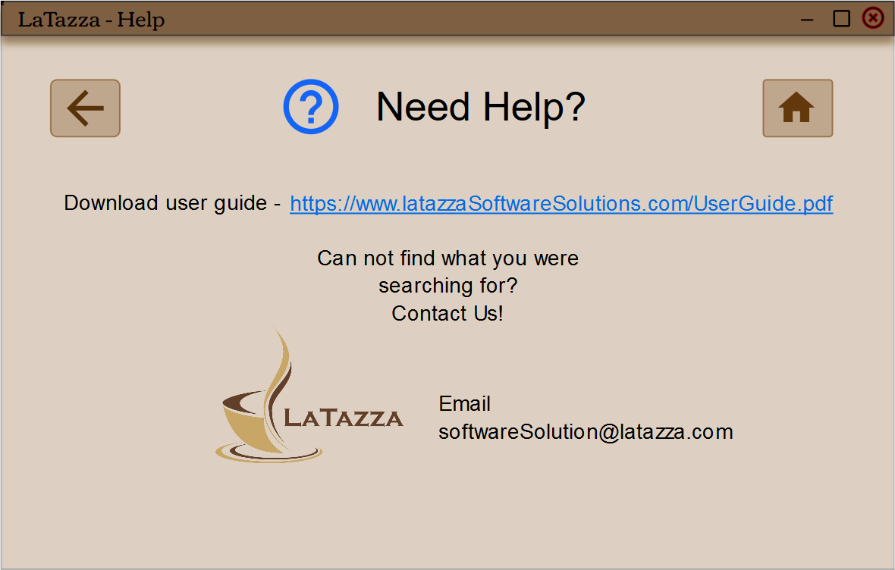

*Figure 12 : Help window*

## Log out

### The manager terminates his operations and logout before closing the application.

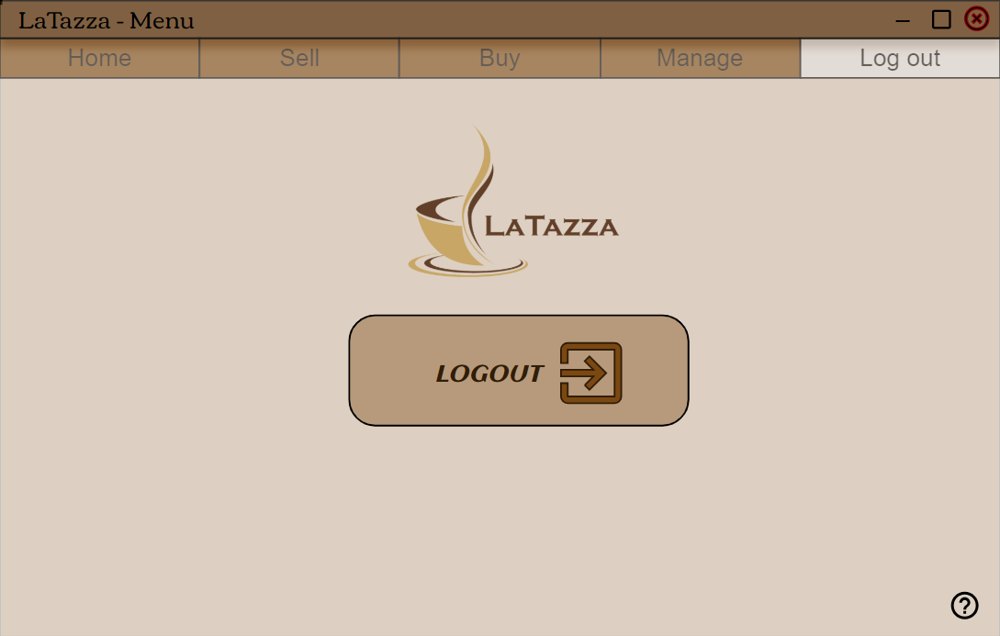

*Figure 13 : LaTazza logout*

