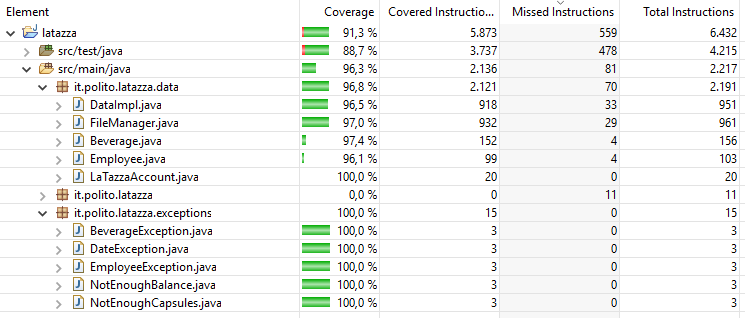

# Unit Testing Documentation template

Authors: Antonino Angi, Giacomo Blanco, Erich Malan, Klodiana Cika

Date: 31/05/2019

Version: 1.5

# Contents

- [Black Box Unit Tests](#black-box-unit-tests)

- [White Box Unit Tests](#white-box-unit-tests)

# Black Box Unit Tests

    <Define here criteria, predicates and the combination of predicates for each function of each class.
    Define test cases to cover all equivalence classes and boundary conditions.
    In the table, report the description of the black box test case and the correspondence with the JUnit black box test case name/number>

 ### Class *FileManager*

 ### method *readEmployees*

**Criteria for method *readEmployees* :**
	

 - Employees written on file

**Predicates for method *readEmployees*:**

| Criteria                  | Predicate |
| ------------------------- | --------- |
| Employees written on file | 0         |
|                           | > 0       |

**Boundaries**: No boundary condition

**Combination of predicates**:

| Employees written on file | Valid / Invalid | Description of the test case | JUnit test case |
|-------|-------|-------|-------|
|0|V|readEmployees() with some employees written on file|it.polito.latazza.data. TestFileManager.testWriteEmployee|
|> 0|V|readEmployees() from empty file|it.polito.latazza.data. TestFileManager.testEmployeesNull|

###  method *readBeverages*

**Criteria for method *readBeverages*:**
	

 - Beverages written on file

**Predicates for method *readBeverages*:**

| Criteria                  | Predicate |
| ------------------------- | --------- |
| Beverages written on file | 0         |
|                           | > 0       |

**Boundaries**: No boundary values

**Combination of predicates**:

| Beverages written on file | Valid / Invalid | Description of the test case | JUnit test case |
|-------|-------|-------|-------|
|0|V|readBeverages() with some beverages written on file|it.polito.latazza.data. TestFileManager.testWriteBeverage|
|> 0|V|readBeverages() from empty file|it.polito.latazza.data. TestFileManager.testBeverageNull|

 ### method *readBalance*

**Criteria for method *readBalance* :**
	

 - balance already written on file

**Predicates for method *readBalance*:**

| Criteria                  | Predicate |
| ------------------------- | --------- |
| balance already written on file | yes         |
|                           | no       |

**Boundaries**: No boundary condition

**Combination of predicates**:

| Balance already written on file | Valid / Invalid | Description of the test case | JUnit test case |
|-------|-------|-------|-------|
|yes|V|readBalance() on an already existing file|it.polito.latazza.data. TestFileManager.testReadBalance|
|no|V|readBalance() when no file exists|it.polito.latazza.data. TestFileManager.testReadBalanceNull|

### method *writeSaleReportEmployee*

**Criteria for method *writeSaleReportEmployee*:**
	

 - Number of reports in file
 - employee id valid (must be > 0)

**Predicates for method *writeSaleReportEmployee*:**

| Criteria                  | Predicate |
| ------------------------- | --------- |
| Number of reports in file | 0         |
|                           | > 0       |
| employee id valid         | yes       |
|                           | no        |

**Boundaries**: No boundary conditions

**Combination of predicates**:

| Number of reports in file | Employee id valid | Valid / Invalid | Description of the test case                                 | JUnit test case                                              |
| ------------------------- | ----------------- | --------------- | ------------------------------------------------------------ | ------------------------------------------------------------ |
| 0                         | yes               | V               | writeSaleReprotemployee() on a file containing some reports  | it.polito.latazza.data. TestFileManager.testEmployeeReport |
| >0                        | yes               | V               | writeSaleReportEmployee() on a empty file                    | it.polito.latazza.data. TestFileManager.testOneEmployeeReport |
| 0                         | no                | V               | writeSaleReportEmployee() on a empty file -->EmployeeException | it.polito.latazza.data. TestFileManager.testWrongEmployeeReport |

### method *writeSaleReportVisitor*

**Criteria for method *writeSaleReportVisitor*:**
	

 - Number of reports in file

**Predicates for method *writeSaleReportVisitor*:**

| Criteria                  | Predicate |
| ------------------------- | --------- |
| Number of reports in file | 0         |
|                           | > 0       |

**Boundaries**: No boundary conditions

**Combination of predicates**:

| Number of reports in file | Valid / Invalid | Description of the test case                               | JUnit test case                                              |
| ------------------------- | --------------- | ---------------------------------------------------------- | ------------------------------------------------------------ |
| 0                         | V               | writeSaleReportVisitor() on a file containing some reports | it.polito.latazza.data. TestFileManager.testVisitorReport |
| >0                        | V               | writeSaleReportVisitor() on a empty file                   | it.polito.latazza.data. TestFileManager.testVisitorReport |

### method *writeBuyReport*

**Criteria for method *writeBuyReport:***
	

 - Number of reports in file

**Predicates for method *writeBuyReport*:**

| Criteria                  | Predicate |
| ------------------------- | --------- |
| Number of reports in file | 0         |
|                           | > 0       |

**Boundaries**: No boundary conditions

**Combination of predicates**:

| Number of reports in file | Valid / Invalid | Description of the test case                       | JUnit test case                                            |
| ------------------------- | --------------- | -------------------------------------------------- | ---------------------------------------------------------- |
| 0                         | V               | writeBuyReport() on a file containing some reports | it.polito.latazza.data. TestFileManager.testBuyReport |
| >0                        | V               | writeBuyReport() on a empty file                   | it.polito.latazza.data. TestFileManager.testBuyReport |

### method *writeEmployee*

**Criteria for method *writeEmployee*:**
	
 - Employee id is valid (must be > 0)
 - Number of existing employees

**Predicates for method *writeEmployee*:**

| Criteria | Predicate |
| -------- | --------- |
| Employee id is valid | yes |
| | no |
| Number of existing employees | 0 |
| | > 0 |

**Boundaries**:no Boundary conditions

**Combination of predicates**:

| Employee id is valid | Number of existing Employees | Valid / Invalid | Description of the test case                           | JUnit test case                                              |
| -------------------- | ---------------------------- | --------------- | ------------------------------------------------------ | ------------------------------------------------------------ |
| yes                  | 0                            | V               | writeEmployee(); on empty file                         | it.polito.latazza.data. TestFileManager.testWriteEmployee |
| yes                  | >0                           | V               | writeEmployee() on a file already containing employees | it.polito.latazza.data. TestFileManager. testWriteEmployeeAppend |
| no                   | 0                            | I               | writeEmployee() with a employee having id < 0          | it.polito.latazza.data. TestFileManager. testWriteWrongEmployee |

### method *updateEmployee*

**Criteria for method *updateEmployee*:**
	

 - Employee present in file
 - Employee id is valid (must be > 0)

**Predicates for method *updateEmployee*:**

| Criteria | Predicate |
| -------- | --------- |
|    Employee present in file    | yes |
|          | no |
| employee id is valid | yes |
| | no |

**Boundaries**:no Boundary conditions

**Combination of predicates**:

| Employee present in file | Employee id is valid | Valid / Invalid | Description of the test case        | JUnit test case                                              |
| ------------------------ | -------------------- | --------------- | ----------------------------------- | ------------------------------------------------------------ |
| yes                      | yes                  | V               | update an employee already existing | it.polito.latazza.data. TestFileManager.testUpdateEmployee |
| no                       | yes                  | V               | update of an non-existing employee  | it.polito.latazza.data. TestFileManager.testUpdateEmployeeNotExisting |
| no                       | no                   | I               | update of an employee with id <= 0  | it.polito.latazza.data. TestFileManager. testUpdateWrongEmployee |

### method *updateBalance*

**Criteria for method *updateBalance* :**
	

 - balance already written on file

**Predicates for method *readBalance*:**

| Criteria                        | Predicate |
| ------------------------------- | --------- |
| balance already written on file | yes       |
|                                 | no        |

**Boundaries**: No boundary condition

**Combination of predicates**:

| Balance already written on file | Valid / Invalid | Description of the test case                | JUnit test case                                              |
| ------------------------------- | --------------- | ------------------------------------------- | ------------------------------------------------------------ |
| yes                             | V               | updateBalance() on an already existing file | it.polito.latazza.data. TestFileManager.testUpdateBalance |
| no                              | V               | updateBalance() when no file exists         | it.polito.latazza.data. TestFileManager.testUpdateBalanceNull |

### method *employeeReport*

**Criteria for method *employeeReport*:**
	

 - Transaction written on a file

**Predicates for method *employeeReport*:**

| Criteria                  | Predicate |
| ------------------------- | --------- |
| Transaction written on a file                      | 0         |
|                           | > 0       |

**Boundaries**: No boundary conditions

**Combination of predicates**:

| Transaction written on a file | Valid / Invalid | Description of the test case                       | JUnit test case                                              |
| ------------------------- | --------------- | -------------------------------------------------- | ------------------------------------------------------------ |
| 0                         | V               | employeeReport() on a file containing some reports | it.polito.latazza.data. TestFileManager.testemployeeReport |
| >0                        | V               | EmployeeReport() on a empty file                   | it.polito.latazza.data. TestFileManager.testEmployeeReportNull |

### method *report*

**Criteria for method *report*:**
	

 - Transaction written on a file

**Predicates for method *report*:**

| Criteria                  | Predicate |
| ------------------------- | --------- |
| Transaction written on a file                      | 0         |
|                           | > 0       |

**Boundaries**: No boundary conditions

**Combination of predicates**:

| Transaction written on a file | Valid / Invalid | Description of the test case                       | JUnit test case                                              |
| ------------------------- | --------------- | -------------------------------------------------- | ------------------------------------------------------------ |
| 0                         | V               | report() on a file containing some reports | it.polito.latazza.data. TestFileManager.testReport |
| >0                        | V               | report() on a empty file                   | it.polito.latazza.data. TestFileManager.testReportNull |

### method *updateBeverage*

**Criteria for method *updateBeverage*:**
	

 - Beverage present in file
 - Beverage id is valid (must be > 0)

**Predicates for method *updateEmployee*:**

| Criteria | Predicate |
| -------- | --------- |
|    Beverage present in file    | yes |
|          | no |
| Beverage id is valid | yes |
| | no |

**Boundaries**:no Boundary conditions

**Combination of predicates**:

| Beverage present in file | Beverage id is valid | Valid / Invalid | Description of the test case        | JUnit test case                                              |
| ------------------------ | -------------------- | --------------- | ----------------------------------- | ------------------------------------------------------------ |
| yes                      | yes                  | V               | update an employee already existing | it.polito.latazza.data. TestFileManager.testUpdateBeverage |
| no                       | yes                  | V               | update of an non-existing employee  | it.polito.latazza.data. TestFileManager.testUpdateNullBeverages |
| no                       | no                   | I               | update of an employee with id <= 0  | it.polito.latazza.data. TestFileManager. testUpdateWrongBeverage |

### method *writeBeverage*

**Criteria for method *writeBeverage*:**
	
 - Beverage id is valid (must be > 0)
 - Number of existing beverages

**Predicates for method *writeBeverage*:**

| Criteria | Predicate |
| -------- | --------- |
| Beverage id is valid | yes |
| | no |
| Number of existing beverages | 0 |
| | > 0 |

**Boundaries**:no Boundary conditions

**Combination of predicates**:

| Beverage id is valid | Number of existing beverages | Valid / Invalid | Description of the test case                           | JUnit test case                                              |
| -------------------- | ---------------------------- | --------------- | ------------------------------------------------------ | ------------------------------------------------------------ |
| yes                  | 0                            | V               | writeBeverage(); on empty file                         | it.polito.latazza.data. TestFileManager.testWriteBeverage |
| yes                  | >0                           | V               | writeBeverage() on a file already containing beverages | it.polito.latazza.data. TestFileManager. testWriteBeverageAppend |
| no                   | 0                            | I               | writeBeverage() with a beverage having id < 0          | it.polito.latazza.data. TestFileManager. testWriteWrongBeverage |

 ### Class *DataImpl*

 ### method *sellCapsules* 

**Criteria for method *sellCapsules*:**
	
 - Employee id valid
 - Beverage id valid
 - Number of capsules
 - from account

**Predicates for method *sellCapsules*:**

| Criteria | Predicate |
| -------- | --------- |
|    Employee id valid     |  yes         |
|          |     no      |
| Beverage id valid | yes |
|          | no |
| Number of capsules | >  available |
| | <  available |
| from account | yes |
| | no |

**Boundaries**:

| Criteria           | Boundary values |
| ------------------ | --------------- |
| Number of capsules | ==  available   |

**Combination of predicates**:

| Employee id valid | Beverage id valid | Number of capsules | from account | Valid / Invalid | Description of the test case | JUnit test case |
|-------|-------|-------|-------|-------|-------|-------|
|yes|yes|< available|no|V|rechargeAccount() BuyBoxes() sellCapsules()|it.polito.latazza.data. TestDataImpl.testSellCapsule|
|no|yes|< available|no|I|rechargeAccount() BuyBoxes() sellCapsules() --> EmployeeException|it.polito.latazza.data. TestDataImpl. testSellCapsuleToNonEmployee|
|yes|no|< available|no|I|rechargeAccount() BuyBoxes() sellCapsules() --> BeverageException|it.polito.latazza.data. TestDataImpl. testSellCapsuleToNonBeverage|
|yes|yes|> available|no|I|rechargeAccount() sellCapsules() --> NotEnoughCapsules|it.polito.latazza.data. TestDataImpl. testSellCapsuleToNonCapsules|
|yes|yes|< available|yes|V|rechargeAccount() BuyBoxes() sellCapsules()|it.polito.latazza.data. TestDataImpl. testSellCapsuleAccount|
|yes|yes|==  available|no|V|rechargeAccount() BuyBoxes() sellCapsules()|it.polito.latazza.data. TestDataImpl. testSellCapsules EqualNumberOfAvailable|

### method *sellCapsulesToVisitor*

**Criteria for method *sellCapsulesToVisitor*:**
	

 - beverage id valid
 - number of capsules

**Predicates for method *sellCapsulesToVisitor*:**

| Criteria           | Predicate    |
| ------------------ | ------------ |
| beverage id valid  | yes          |
|                    | no           |
| number of capsules | <  available |
|                    | >  available |

**Boundaries**:

| Criteria           | Boundary values |
| ------------------ | --------------- |
| number of capsules | ==  available   |

**Combination of predicates**:

| Beverage id valid | Number of capsules | Valid / Invalid | Description of the test case | JUnit test case |
|-------|-------|-------|-------|-------|
|yes|<  available|V|rechargeAccount() BuyBoxes() sellCapsulesToVisitor()|it.polito.latazza.data. TestDataImpl.testSellCapsuleToVisitor|
|yes|> available|I|rechargeAccount() sellCapsulesToVisitor() --> NotEnoughCapsules|it.polito.latazza.data. TestDataImpl.testSellCapsuleVisitor ToNonCapsules|
|no|< available|I|rechargeAccount() sellCapsulesToVisitor() --> BeverageException|it.polito.latazza.data. TestDataImpl.testSellCapsuleVisitor ToNonBeverage|
|yes|== available|V|rechargeAccount() BuyBoxes() sellCapsulesToVisitor()|it.polito.latazza.data. TestDataImpl. testSellCapsulesVisitor EqualNumberOfAvailable|

### method *rechargeAccount*

**Criteria for method *rechargeAccount*:**
	

 - Employee id valid
 - Amount is valid (must be > 0)

**Predicates for method *rechargeAccount*:**

| Criteria          | Predicate |
| ----------------- | --------- |
| Employee id valid | yes       |
|                   | no        |
| Amount is valid   | yes       |
|                   | no        |

**Boundaries**: no boundary conditions

**Combination of predicates**:

| Employee id valid | Amount is valid | Valid / Invalid | Description of the test case | JUnit test case |
|-------|-------|-------|-------|-------|
|yes|yes|V|rechargeAccount()|it.polito.latazza.data. TestDataImpl. testRechargeAccount|
|no|yes|I|rechargeAccount with wrong EmployeeId --> EmployeeException|it.polito.latazza.data. TestDataImpl. testRechargeAccount ToNonEmployee|
|yes|no|I|rechargeAccount with amount negative or 0 --> EmployeeException|it.polito.latazza.data. TestDataImpl. testRechargeAccount InvalidAmount|

### method *updateEmployee*

**Criteria for method *updateEmployee*:**
	

 - employee id valid

**Predicates for method *updateEmployee*:**

| Criteria           | Predicate    |
| ------------------ | ------------ |
| employee id valid  | yes          |
|                    | no           |

**Combination of predicates**:

| Employee id valid | Valid / Invalid | Description of the test case | JUnit test case |
|-------|-------|-------|-------|
|yes|V|updateEmployee()|it.polito.latazza.data. TestDataImpl. testUpdateEmployee|
|no|I|UpdateEmployee() --> EmployeeException|it.polito.latazza.data. TestDataImpl. testUpdateEmployee NotExisting|

### method *getEmployeeName*

**Criteria for method *getEmployeeName*:**
	

 - employee id valid

**Predicates for method *getEmployeeName*:**

| Criteria           | Predicate    |
| ------------------ | ------------ |
| employee id valid  | yes          |
|                    | no           |

**Combination of predicates**:

| Employee id valid | Valid / Invalid | Description of the test case | JUnit test case |
|-------|-------|-------|-------|
|yes|V|getEmployeeName()|it.polito.latazza.data. TestDataImpl. testEmployeeName|
|no|I|testgetEmployeeName --> EmployeeException|it.polito.latazza.data. TestDataImpl. testgetEmployeeName NonExisting|

### method *getEmployeeSurname*

**Criteria for method *getEmployeeSurname*:**
	

 - employee id valid

**Predicates for method *getEmployeeSurname*:**

| Criteria           | Predicate    |
| ------------------ | ------------ |
| employee id valid  | yes          |
|                    | no           |

**Combination of predicates**:

| Employee id valid | Valid / Invalid | Description of the test case | JUnit test case |
|-------|-------|-------|-------|
|yes|V|getEmployeeSurname()|it.polito.latazza.data. TestDataImpl. testEmployeeSurname|
|no|I|getEmployeeSurame() --> EmployeeException|it.polito.latazza.data. TestDataImpl. testgetEmployeeSurname NonExisting|

### method *getEmployeeBalance*

**Criteria for method *getEmployeeBalance*:**
	

 - employee id valid

**Predicates for method *getEmployeeBalance*:**

| Criteria           | Predicate    |
| ------------------ | ------------ |
| employee id valid  | yes          |
|                    | no           |

**Combination of predicates**:

| Employee id valid | Valid / Invalid | Description of the test case | JUnit test case |
|-------|-------|-------|-------|
|yes|V|getEmployeeBalance()|it.polito.latazza.data. TestDataImpl. testEmployeeBalance|
|no|I|getEmployeeBalance() --> EmployeeException|it.polito.latazza.data. TestDataImpl. testEmployeeBalance NonExisting|

### method *getEmployeesId*

**Criteria for method *getEmployeesId*:**
	

 - existing employees

**Predicates for method *getEmployeesId*:**

| Criteria           | Predicate    |
| ------------------ | ------------ |
| Existing employees | > 0     |
|                    | 0           |

**Combination of predicates**:

| Existing employees | Valid / Invalid | Description of the test case | JUnit test case |
|-------|-------|-------|-------|
| > 0                |V|getEmployeesId()|it.polito.latazza.data. TestDataImpl. testEmployeesId|
|0|V|getEmployeesId() with no employees|it.polito.latazza.data. TestDataImpl. testEmployeesId Empty|

### method *getEmployees*

**Criteria for method *getEmployees*:**
	

 - existing employees

   

**Predicates for method *getEmployees*:**

| Criteria           | Predicate    |
| ------------------ | ------------ |
| existing employees | > 0        |
|                    | 0           |

**Combination of predicates**:

| Existing employees | Valid / Invalid | Description of the test case | JUnit test case |
|-------|-------|-------|-------|
|> 0|V|getEmployees()|it.polito.latazza.data. TestDataImpl. testEmployees|
|0|V|getEmployees() with no employees|it.polito.latazza.data. TestDataImpl. testgetEmployees Empty|

### method *buyBoxes*

**Criteria for method *buyBoxes*:**
	

 - Beverage id valid
 - Balance valid

**Predicates for method *buyBoxes*:**

| Criteria          | Predicate |
| ----------------- | --------- |
| Beverage id valid | yes       |
|                   | no        |
| Balance valid| >= price |
| | < price |

**Boundaries**: Account balance = boxes price

**Combination of predicates**:

| Beverage id valid | Balance valid | Valid / Invalid | Description of the test case                       | JUnit test case                                              |
| ------------------------- | --------------- | -------------------------------------------------- | ------------------------- | ------------------------ |
|yes|>= price|V|buyBoxes()|it.polito.latazza.data. TestDataImpl. testBuyBoxes   Valid|
|no|>= price|I|buyBoxes() -->BeverageException|it.polito.latazza.data. TestDataImpl. testBuyBoxes  NotValidBeverageId|
|yes|< price|I|buyBoxes() -->NotEnoughBalance|it.polito.latazza.data. TestDataImpl. testBuyBoxes  NotValidBalance|
|yes|= price|V|buyBoxes()|it.polito.latazza.data. TestDataImpl. testBuyBoxes   ValidEqualNumberOfAvailable|

### method *getEmployeeReport*

**Criteria for method *getEmployeeReport*:**
	

 - Employee id valid
 - Start date valid (must be before or equals to the current day and not null)
 - End date valid (must be before or equals to the current day and not null)
 - Start-End Date valid (End date must be after start date)

**Predicates for method *getEmployeeReport*:**

| Criteria          | Predicate |
| ----------------- | --------- |
| Employee id valid | yes       |
|                   | no        |
| Start Date valid| yes |
| | no |
| End Date valid | yes|
| | no |
| Start-End Date valid | yes |
| | no |

**Boundaries**: Start and End Date are equals

**Combination of predicates**:

| Employee id valid | Start Date valid | End Date valid | Start-End Date valid | Valid / Invalid | Description of the test case                       | JUnit test case                                              |
| ------------------------- | --------------- | -------------------------------------------------- | ------------------------------------------------------------ | ------------------------------------------------------------ | ------------------------------------------------------------ | ------------------------------------------------------------ |
| yes| yes | yes | yes | V | getEmployeeReport() | it.polito.latazza.data. TestDataImpl. testEmployeeReport |
| yes | yes | yes | no | I |  getEmployeeReport() -->DateException | it.polito.latazza.data. TestDataImpl. testDateEmployeeException |
| yes | yes | no | yes | I | getEmployeeReport() -->DateException | it.polito.latazza.data. TestDataImpl. testDateEmployeeException |
| yes | no | yes | yes | I | getEmployeeReport() -->DateException | it.polito.latazza.data. TestDataImpl. testDateEmployeeException |
| no | yes | yes | yes | I | getEmployeeReport() -->EmployeeException | it.polito.latazza.data. TestDataImpl. testDateEmployeeException |
| yes | yes | yes | equals | V | getEmployeeReport() with start date equals to endDate | it.polito.latazza.data. TestDataImpl. testEmployeeReportEqualDates |

### method *getReport*

**Criteria for method *getReport*:**
	

 - Start date valid (must be before or equals to the current day and not null)
 - End date valid (must be before or equals to the current day and not null)
 - Start-End Date valid (End date must be after Start date)

**Predicates for method *getReport*:**

| Criteria          | Predicate |
| ----------------- | --------- |
| Start Date valid| yes |
| | no |
| End Date valid | yes|
| | no |
| Start-End Date valid | yes |
| | no |

**Boundaries**: Start and End Date are equals

**Combination of predicates**:

| Start Date valid | End Date valid | Start-End Date valid | Valid / Invalid | Description of the test case                       | JUnit test case                                              |
| --------------- | -------------------------------------------------- | ------------------------------------------------------------ | ------------------------------------------------------------ | ------------------------------------------------------------ | ------------------------------------------------------------ |
| yes | yes | yes | V | doing some transaction; getReport(); | it.polito.latazza.data. TestDataImpl. testGetReport |
| no | yes | yes | I | doing some transaction; getReport(); --> DateException | it.polito.latazza.data. TestDataImpl. testGetReportUnvalidDates |
| yes | no | yes | I | doing some transaction; getReport(); --> DateException | it.polito.latazza.data. TestDataImpl. testGetReportUnvalidDates |
| yes | yes | no | I | doing some transaction; getReport(); --> DateException | it.polito.latazza.data. TestDataImpl. testGetReportUnvalidDates |
| yes | yes | equals | V | getEmployeeReport() with start date equals to endDate | it.polito.latazza.data. TestDataImpl. testReportEqualDates |

### method *updateBeverage*

**Criteria for method *updateBeverage*:**
	

 - Beverage id valid
 - box price is valid (must be > 0)
 - capsules per box is valid (must be > 0 )

**Predicates for method *updateBeverage*:**

| Criteria          | Predicate |
| ----------------- | --------- |
| Beverage id valid | yes |
| | no |
| boxPrice is valid | yes |
| | no |
| capusule per box is valid | yes |
| | no |

**Boundaries**: No boundary condition

**Combination of predicates**:

| Beverage id valid | box price is valid | capsules per box is valid | Valid / Invalid | Description of the test case                       | JUnit test case                                              |
| ------------------------- | ------------------------------------------------------------ | ------------------------------------------------------------ | ------------------------------------------------------------ | ------------------------------------------------------------ | ------------------------------------------------------------ |
|yes|yes|yes| V | updateBeverage() | it.polito.latazza.data. TestDataImpl. testupdateBeverageUpdating|
|no|yes|yes| I | updateBeverage() --> BeverageExcpetion | it.polito.latazza.data. TestDataImpl. testupdateBeverageNotExistBev|
|yes|no|yes| I | updateBeverage() with box price < 0 -->BeverageException | it.polito.latazza.data. TestDataImpl. testupdateBeverage WrongBoxPrice |
|yes|yes|no| I | updateBeverage() with capsules per box < 0 -->BeverageException | it.polito.latazza.data. TestDataImpl. testupdateBeverage WrongCapsules |

### method *createBeverage*

**Criteria for method *createBeverage*:**
	

 - box price is valid (must be > 0)
 - capsules per box is valid (must be > 0 )

**Predicates for method *updateBeverage*:**

| Criteria          | Predicate |
| ----------------- | --------- |
| boxPrice is valid | yes |
| | no |
| capusule per box is valid | yes |
| | no |

**Boundaries**: No boundary condition

**Combination of predicates**:

| box price is valid | capsules per box is valid | Valid / Invalid | Description of the test case                       | JUnit test case                                              |
| ------------------------------------------------------------ | ------------------------------------------------------------ | ------------------------------------------------------------ | ------------------------------------------------------------ | ------------------------------------------------------------ |
|yes|yes| V | createBeverage() | it.polito.latazza.data. TestDataImpl. testcreateBeverage |
|no|yes| I | createBeverage() with box price < 0 -->BeverageException | it.polito.latazza.data. TestDataImpl. testCreateBeverage WrongBoxPrice |
|yes|no| I | createBeverage() with capsules per box < 0 -->BeverageException | it.polito.latazza.data. TestDataImpl. testCreateBeverage WrongCapsules |

### method *getBeverageName*

**Criteria for method *getBeverageName*:**
	

 - beverage id valid

**Predicates for method *getBeverageName*:**

| Criteria | Predicate |
| -------- | --------- |
|    beverage id valid      | yes |
|          | no |

**Boundaries**: No boundary conditions

**Combination of predicates**:

| beverage id valid | Valid / Invalid | Description of the test case | JUnit test case |
|-------|-------|-------|-------|
|yes|V|getBeverageName()|it.polito.latazza.data. TestDataImpl. testgetBeverageNameCheck|
|no|I|getBeverageName() --> BeverageException|it.polito.latazza.data. TestDataImpl. testgetBeverageName NotExistBev|

### method *getBeverageCapsulesPerBox*

**Criteria for method *getBeverageCapsulesPerBox*:**
	

 - beverage id valid

**Predicates for method *getBeverageCapsulesPerBox*:**

| Criteria | Predicate |
| -------- | --------- |
|    beverage id valid    | yes |
|          | no |

**Boundaries**: No boundary conditions

**Combination of predicates**:

| beverage id valid | Valid / Invalid | Description of the test case                           | JUnit test case                                              |
| ----------------- | --------------- | ------------------------------------------------------ | ------------------------------------------------------------ |
| yes               | V               | getBeverageCapsulesPerBox()                            | it.polito.latazza.data. TestDataImpl. testgetBeverageCapsulesPerBox |
| no                | I               | getBeverageCapsulesPerBox() --> BeverageException | it.polito.latazza.data. TestDataImpl. testgetBeverageCapsulesPerBox NotExist |

### method *getBeverageBoxPrice*

**Criteria for method *getBeverageBoxPrice*:**
	

 - beverage id valid

**Predicates for method *getBeverageBoxPrice*:**

| Criteria | Predicate |
| -------- | --------- |
|    beverage id valid    | yes |
|          | no |

**Boundaries**: No boundary conditions

**Combination of predicates**:

| beverage id valid | Valid / Invalid | Description of the test case                             | JUnit test case                                              |
| ----------------- | --------------- | -------------------------------------------------------- | ------------------------------------------------------------ |
| yes               | V               | getBeverageBoxPrice()                                    | it.polito.latazza.data. TestDataImpl. testgetBeverageBoxPrice |
| no                | I               | getBeverageCapsulesBoxPrice() --> BeverageException | it.polito.latazza.data. TestDataImpl. testgetBeverageBoxPrice NotExist |

### method *getBeveragesId*

**Criteria for method *getBeveragesId*:**
	

 - existing beverages

**Predicates for method *getBeveragesId*:**

| Criteria           | Predicate |
| ------------------ | --------- |
| existing beverages | 0         |
|                    | > 0       |

**Boundaries**: No boundary values

**Combination of predicates**:

| existing beverages | Valid / Invalid | Description of the test case | JUnit test case |
|-------|-------|-------|-------|
|0|V|getBeveragesId() with no beverages|it.polito.latazza.data. TestDataImpl. testgetBeveragesIdEmpty|
|> 0|V|getBeveragesId()|it.polito.latazza.data. TestDataImpl. testgetBeveragesId|

### method *getBeverages*

**Criteria for method *getBeverages*:**
	

 - existing beverages

**Predicates for method *getBeverages*:**

| Criteria           | Predicate |
| ------------------ | --------- |
| existing beverages | 0         |
|                    | > 0       |

**Boundaries**: No boundary values

**Combination of predicates**:

| existing beverages | Valid / Invalid | Description of the test case | JUnit test case |
|-------|-------|-------|-------|
|0|V|getBeverages() with no beverages|it.polito.latazza.data. TestDataImpl. testgetBeveragesEmpty|
|> 0|V|getBeverages()|it.polito.latazza.data. TestDataImpl. testgetBeverages|

### method *getBeverageCapsules*

**Criteria for method *getBeverageCapsules*:**

 - beverages id valid 

**Predicates for method *getBeverageCapsules*:**

| Criteria          | Predicate |
| ----------------- | --------- |
| beverage id valid | yes       |
|                   | no        |

**Boundaries**: No boundary values

**Combination of predicates**:

| beverage id valid | Valid / Invalid | Description of the test case | JUnit test case |
|-------|-------|-------|-------|
|yes|V|getBeverageCapsules()|it.polito.latazza.data. TestDataImpl. testgetBeverageCapsules|
|no|I|getBeverageCapsules() --> BeverageException|it.polito.latazza.data. TestDataImpl. testgetBeverageCapsulesNotExist|

# White Box Unit Tests

### Test cases definition

| Unit name | JUnit test case |
|--|--|
|DataImpl|it.polito.latazza.data.TestDataImpl|
|FileManager|it.polito.latazza.data.TestFileManager|

### Code coverage report

   

### Loop coverage analysis

    <Identify significant loops in the units and reports the test cases
    developed to cover zero, one or multiple iterations >

|Unit name | Loop rows | Number of iterations | JUnit test case |
|---|---|---|---|
|FileManager.readEmployees|35-42|0|it.polito.latazza.data.TestFileManager. testEmployeesNull|
|||1|it.polito.latazza.data.TestFileManager. testReadOneEmployee|
|||>1|it.polito.latazza.data.TestFileManager. testWriteEmployee|
|FileManager.readBeverages|65-74|0|it.polito.latazza.data.TestFileManager. testBeverageNull|
| | | 1 | it.polito.latazza.data.TestFileManager. testReadOneBeverage |
|||>1|it.polito.latazza.data.TestFileManager. testWriteBeverage|
|FileManager.updateEmployee|175-188|0|it.polito.latazza.data.TestFileManager. testUpdateNullEmployees|
| |  | 1 | it.polito.latazza.data.TestFileManager. testUpdateFirstEmployee |
| |  | > 1 | it.polito.latazza.data.TestFileManager. testUpdateEmployee |
| FileManager.updateBeverage | 224-236 | 0 | it.polito.latazza.data.TestFileManager. testUpdateNullBeverages |
| |  | 1 | it.polito.latazza.data.TestFileManager. testUpdateFirstBeverage |
| |  | > 1 | it.polito.latazza.data.TestFileManager. testUpdateBeverage |
| FileManager.employeeReport | 320 - 332 | 0 | it.polito.latazza.data.TestFileManager. testEmployeeReportNull |
| |  | 1 | it.polito.latazza.data.TestFileManager. testOneEmployeeReport |
| |  | > 1 | it.polito.latazza.data.TestFileManager. testEmployeeReport |
| FileManager.report | 355-366 | 0 | it.polito.latazza.data.TestFileManager. testReportNull |
| |  | 1 | it.polito.latazza.data.TestFileManager. testOneReport |
| |  | > 1 | it.polito.latazza.data.TestFileManager. testReport |

