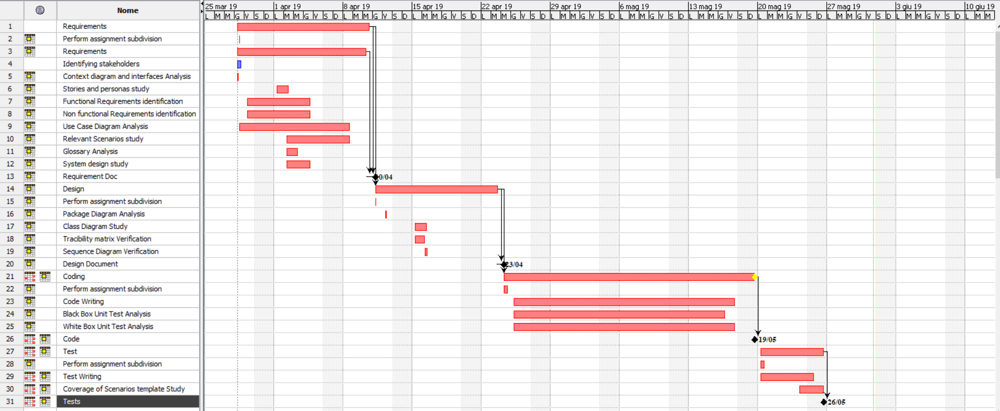

# Project Estimation  template

Authors: Antonino Angi, Giacomo Blanco, Klodiana Cika, Erich Malan

Date: 30/05/2019

Version: 1.2

# Contents

- [[Data from your LaTazza project]

- [Estimate by product decomposition]
- [Estimate by activity decomposition ]

# Data from your LaTazza project

###

|         Total person days worked by your  team, considering period March 5 to April 26 (1 person day == 8 person hours)     | 22 |             
| ----------- | ------------------------------- | 
|Total Java LoC delivered on April 26 (only code, no Junit code) | 982 |
| Total number of Java classes delivered on April 26 (only code, no Junit code)| 5 |
| Productivity P =|5.58 |
|Average size of Java class A = | 196.4|

# Estimate by product decomposition

### 

|             | Estimate                        |             
| ----------- | ------------------------------- |  
| Estimated n classes   |              5               |             
| Estimated LOC per class  (Here use Average A computed above )      |   196.4                         |                
| Estimated effort  (person days) (Here use productivity P)  |          5.58                           |      
| Estimated calendar time (calendar weeks) (Assume team of 4 people, 8 hours per day, 5 days per week ) |        5            |               

# Estimate by activity decomposition

### Requirements 

|         Activity Name   | Estimated effort    |             
| ----------- | ------------------------------- |  
|Perform assignment subdivision | 1.5 |
|Identifying stakeholders | 2.5  |
|Context diagram and interfaces Analysis | 2.5 |
|Stories and personas study| 6 |
|Functional Requirements identification | 7 |
|Non functional Requirements identification | 5 |
|Use Case Diagram Analysis | 4 |
|Relevant scenarios study | 20 |
|Glossary Analysis | 10.5 |
|System design study | 1 |
|TOTAL | 60 |

### Design 

|         Activity Name   | Estimated effort    |             
| ----------- | ------------------------------- |  
|Perform assignment subdivision | 1.5 |
|Package Diagram Analysis | 2.5  |
|Class Diagram Study | 12 |
|Tracibility matrix Verification| 8.5|
|Sequence Diagrams Verification | 5.5 |
|TOTAL | 30 |

### Coding 

|         Activity Name   | Estimated effort    |             
| ----------- | ------------------------------- |  
|Perform assignment subdivision | 1.5 |
|Code Writing | 18.5  |
|Black Box Unit Test Analysis | 6 |
|White Box Unit Test Analysis | 3 |
|TOTAL | 29 |

### Test 

|         Activity Name   | Estimated effort    |             
| ----------- | ------------------------------- |  
|Perform assignment subdivision | 1.5 |
|Test Writing | 45  |
|Coverage of Scenarios template Study | 8.5 |
|Coverage of non-functional requirements Study | 2 |
|TOTAL | 57 |

### Gant 

